# 🐳 Docker Complete Guide

> A comprehensive beginner-to-advanced Docker guide for day-to-day use. All commands with explanations and examples.

[](https://www.docker.com/)
[](LICENSE)

---

## 📑 Table of Contents

- [What is Docker?](#-what-is-docker)
- [How Docker Works](#-how-docker-works)
- [Why Use Docker?](#-why-use-docker)
- [Installation](#-installation)
- [Docker Images](#-docker-images)
- [Docker Containers](#-docker-containers)
- [Docker Run (Complete Guide)](#-docker-run-complete-guide)
- [Dockerfile](#-dockerfile)
- [Docker Compose](#-docker-compose)
- [Docker Networking](#-docker-networking)
- [Docker Volumes](#-docker-volumes)
- [Logs & Debugging](#-logs--debugging)
- [Resource Management](#-resource-management)
- [Docker Hub & Registries](#-docker-hub--registries)
- [Real-World Workflows](#-real-world-workflows)
- [Troubleshooting](#-troubleshooting)
- [Quick Reference](#-quick-reference)

---

## 🐳 What is Docker?

Docker is a platform that packages applications into **containers** — lightweight, standalone, executable units that include everything needed to run: code, runtime, libraries, and dependencies.

### Key Concepts

| Term | Description |
|------|-------------|
| **Image** | A read-only template/blueprint for creating containers |
| **Container** | A running instance of an image (isolated process) |
| **Dockerfile** | A text file with instructions to build an image |
| **Docker Hub** | Public registry for sharing Docker images |
| **Volume** | Persistent storage for container data |
| **Network** | Communication channel between containers |

---

## ⚙️ How Docker Works

Docker uses a **client-server architecture**:

<p align="center">
  
</p>

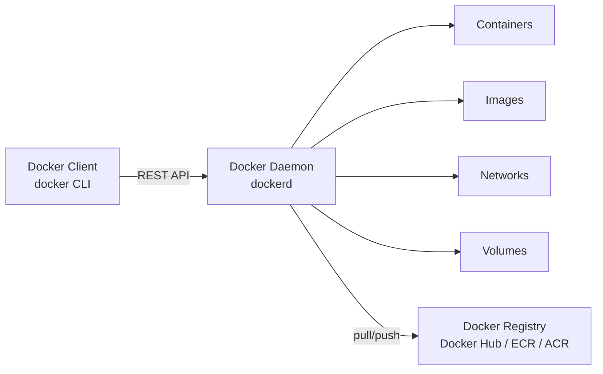

- **Docker Client** — CLI tool you interact with (`docker` command)
- **Docker Daemon** — Background service that manages containers, images, networks, volumes
- **Docker Registry** — Stores and distributes Docker images

### Docker vs Virtual Machines

<p align="center">
  
</p>

| Feature | Docker Container | Virtual Machine |
|---------|-----------------|-----------------|
| Boot time | Seconds | Minutes |
| Size | MBs | GBs |
| OS | Shares host kernel | Full OS |
| Isolation | Process-level | Hardware-level |
| Performance | Near-native | Overhead |
| Density | 100s per host | 10s per host |

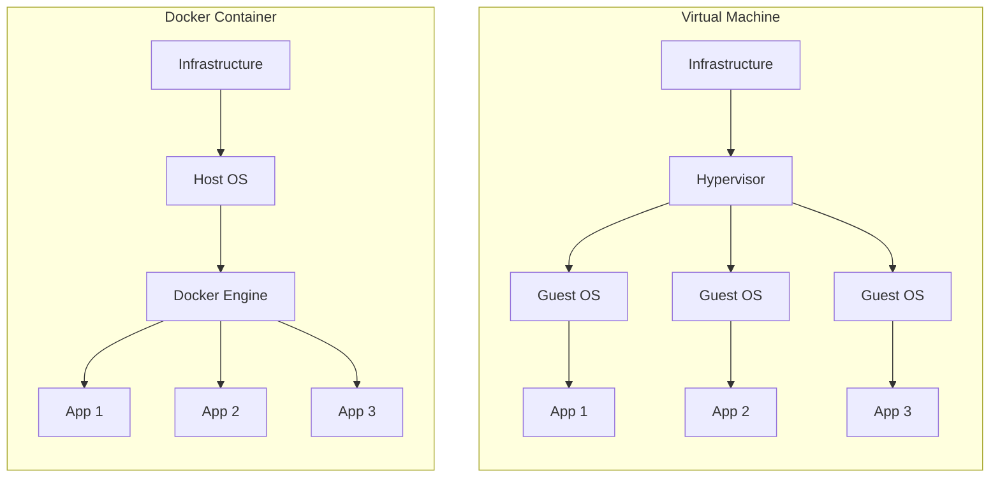

---

## 💡 Why Use Docker?

- **Consistency** — "Works on my machine" problem solved
- **Isolation** — Each app runs in its own environment
- **Portability** — Run anywhere: laptop, server, cloud
- **Scalability** — Easy to scale up/down
- **Speed** — Start containers in seconds
- **CI/CD** — Consistent build and deploy pipelines
- **Microservices** — Perfect for service-oriented architecture
- **Version Control** — Tag and rollback images easily

---

## 📥 Installation

### Windows
```bash
# Download Docker Desktop from https://www.docker.com/products/docker-desktop
# Or use winget:
winget install Docker.DockerDesktop
```

### Linux (Ubuntu/Debian)
```bash
# Remove old versions
sudo apt remove docker docker-engine docker.io containerd runc

# Install using official script
curl -fsSL https://get.docker.com -o get-docker.sh
sudo sh get-docker.sh

# Add user to docker group (avoid sudo)
sudo usermod -aG docker $USER

# Start Docker
sudo systemctl start docker
sudo systemctl enable docker
```

### macOS
```bash
# Using Homebrew
brew install --cask docker
```

### Verify Installation
```bash
docker --version
docker info
docker run hello-world
```

---


## 🖼️ Docker Images

Images are read-only templates used to create containers.

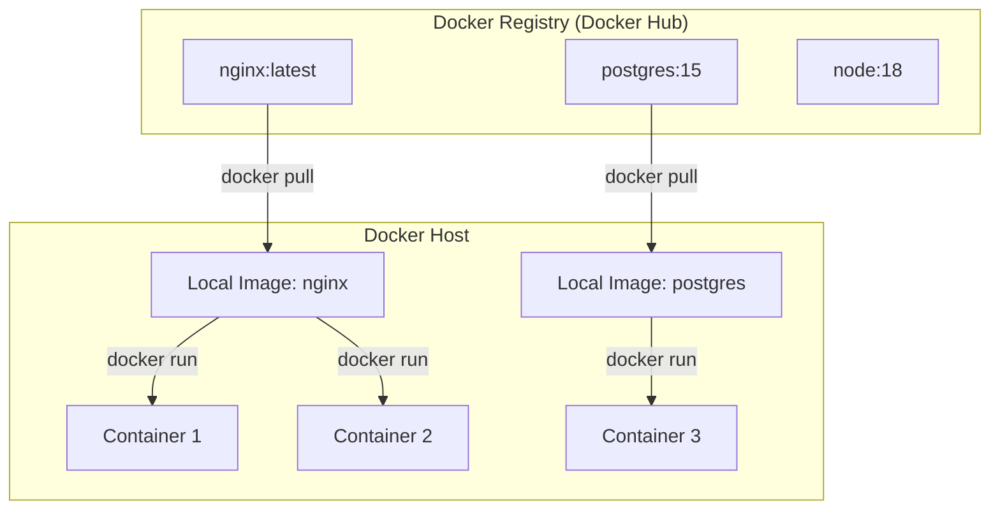

### Image Layers

<p align="center">
  
</p>

> Each instruction in a Dockerfile creates a new layer. Layers are cached and reused to speed up builds.

### List Images
```bash
# List all images
docker images

# List with custom format
docker images --format "table {{.Repository}}\t{{.Tag}}\t{{.Size}}"

# List only image IDs
docker images -q

# Filter by name
docker images nginx

# Show image layers/history
docker history nginx:latest
```

### Pull Images
```bash
# Pull latest
docker pull nginx

# Pull specific version
docker pull nginx:1.21

# Pull from private registry
docker pull registry.example.com/myapp:latest
```

### Build Images
```bash
# Build from Dockerfile in current directory
docker build -t myapp:latest .

# Build with specific Dockerfile
docker build -f Dockerfile.prod -t myapp:prod .

# Build without cache
docker build --no-cache -t myapp:latest .

# Build with build arguments
docker build --build-arg NODE_ENV=production -t myapp:latest .

# Build with multiple tags
docker build -t myapp:latest -t myapp:1.0.0 .
```

### Tag Images
```bash
# Tag an existing image
docker tag myapp:latest myapp:1.0.0

# Tag for a different registry
docker tag myapp:latest registry.example.com/myapp:latest
```

### Remove Images
```bash
# Remove specific image
docker rmi nginx:latest

# Force remove
docker rmi -f nginx:latest

# Remove all unused images
docker image prune

# Remove ALL images (use with caution)
docker rmi $(docker images -q)
```

### Inspect Images
```bash
# Full details
docker inspect nginx:latest

# Show environment variables
docker inspect -f '{{.Config.Env}}' nginx:latest

# Show image size
docker images nginx:latest --format "{{.Size}}"
```

### Save & Load (Offline Transfer)
```bash
# Save image to tar file
docker save -o myapp.tar myapp:latest

# Load image from tar file
docker load -i myapp.tar
```

---


## 📦 Docker Containers

Containers are running instances of images.

### Container Lifecycle

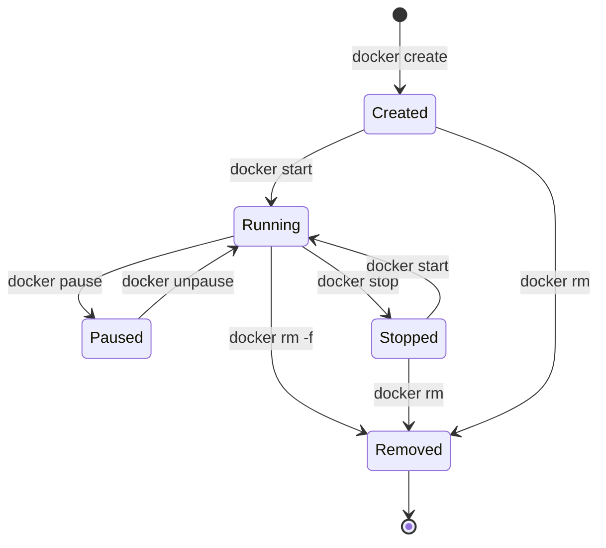

### List Containers
```bash
# List running containers
docker ps

# List ALL containers (including stopped)
docker ps -a

# List only container IDs
docker ps -q

# List with custom format
docker ps --format "table {{.Names}}\t{{.Status}}\t{{.Ports}}"

# Filter containers
docker ps --filter "status=exited"
docker ps --filter "name=web"
```

### Create Containers (without starting)
```bash
docker create --name myapp nginx:latest
docker create --name myapp -p 8080:80 -e ENV=prod nginx:latest
```

### Start / Stop / Restart
```bash
# Start
docker start myapp

# Start and attach to output
docker start -a myapp

# Stop gracefully (SIGTERM, then SIGKILL after 10s)
docker stop myapp

# Stop with custom timeout
docker stop -t 5 myapp

# Force kill immediately (SIGKILL)
docker kill myapp

# Restart
docker restart myapp

# Pause / Unpause
docker pause myapp
docker unpause myapp
```

### Remove Containers
```bash
# Remove stopped container
docker rm myapp

# Force remove running container
docker rm -f myapp

# Remove all stopped containers
docker container prune

# Remove all containers (force)
docker rm -f $(docker ps -aq)
```

### Copy Files
```bash
# Copy from host to container
docker cp ./file.txt myapp:/app/file.txt

# Copy from container to host
docker cp myapp:/app/logs ./logs
```

### Rename Container
```bash
docker rename old_name new_name
```

---


## 🚀 Docker Run (Complete Guide)

`docker run` = `docker create` + `docker start`. The most used Docker command.

### Basic Usage
```bash
# Run in foreground
docker run nginx:latest

# Run in background (detached)
docker run -d nginx:latest

# Run with a name
docker run -d --name web nginx:latest

# Run and auto-remove when stopped
docker run --rm nginx:latest

# Run with interactive terminal
docker run -it ubuntu:latest /bin/bash
```

### Port Mapping (-p)

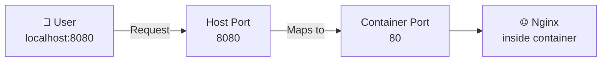

```bash
# Map host:container port
docker run -d -p 8080:80 nginx

# Map to specific host IP
docker run -d -p 127.0.0.1:8080:80 nginx

# Map multiple ports
docker run -d -p 8080:80 -p 8443:443 nginx

# Map random host port
docker run -d -p 80 nginx

# Expose all declared ports to random host ports
docker run -d -P nginx
```

### Environment Variables (-e)
```bash
# Single variable
docker run -e NODE_ENV=production myapp

# Multiple variables
docker run -e NODE_ENV=production -e DB_HOST=localhost myapp

# From env file
docker run --env-file .env myapp

# Pass host variable
docker run -e HOME myapp
```

### Volume Mounts (-v)
```bash
# Bind mount (host directory)
docker run -v /host/path:/container/path nginx

# Named volume
docker run -v mydata:/app/data nginx

# Read-only mount
docker run -v /host/path:/container/path:ro nginx

# Anonymous volume
docker run -v /container/path nginx
```

### Network Options
```bash
# Connect to specific network
docker run --network mynetwork nginx

# Use host network
docker run --network host nginx

# No networking
docker run --network none nginx

# Set hostname
docker run --hostname myhost nginx

# Add DNS
docker run --dns 8.8.8.8 nginx
```

### Resource Limits
```bash
# Memory limit
docker run -m 512m nginx

# CPU limit (1.5 cores)
docker run --cpus="1.5" nginx

# Memory + CPU
docker run -m 512m --cpus="1.0" nginx

# CPU shares (relative weight)
docker run --cpu-shares=512 nginx
```

### Restart Policies
```bash
# Never restart (default)
docker run --restart=no nginx

# Always restart
docker run --restart=always nginx

# Restart on failure (max 3 attempts)
docker run --restart=on-failure:3 nginx

# Restart unless manually stopped
docker run --restart=unless-stopped nginx
```

### Other Useful Flags
```bash
# Set working directory
docker run -w /app myapp

# Override entrypoint
docker run --entrypoint /bin/bash myapp

# Add host entry
docker run --add-host myhost:192.168.1.1 nginx

# Set user
docker run -u 1000:1000 myapp

# Privileged mode (full host access - use carefully)
docker run --privileged nginx

# Read-only filesystem
docker run --read-only nginx
```

### Common Patterns
```bash
# Web server
docker run -d -p 8080:80 --name web nginx:latest

# Database with persistent storage
docker run -d -p 5432:5432 \
  --name postgres \
  -e POSTGRES_PASSWORD=secret \
  -e POSTGRES_DB=myapp \
  -v pgdata:/var/lib/postgresql/data \
  postgres:15

# Development container with live code
docker run -it -p 3000:3000 \
  -v $(pwd):/app \
  --name dev \
  node:18 bash

# One-off command
docker run --rm ubuntu:latest cat /etc/os-release

# Redis cache
docker run -d -p 6379:6379 --name redis redis:7-alpine
```

---


## 📝 Dockerfile

A Dockerfile is a text file with instructions to build a Docker image.

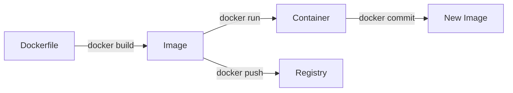

### All Dockerfile Instructions

| Instruction | Purpose | Example |
|-------------|---------|---------|
| `FROM` | Base image | `FROM node:18-alpine` |
| `WORKDIR` | Set working directory | `WORKDIR /app` |
| `COPY` | Copy files from host | `COPY . .` |
| `ADD` | Copy with URL/tar support | `ADD app.tar.gz /app` |
| `RUN` | Execute command during build | `RUN npm install` |
| `CMD` | Default command at runtime | `CMD ["node", "index.js"]` |
| `ENTRYPOINT` | Fixed entry command | `ENTRYPOINT ["python"]` |
| `ENV` | Set environment variable | `ENV NODE_ENV=production` |
| `ARG` | Build-time variable | `ARG VERSION=latest` |
| `EXPOSE` | Document port | `EXPOSE 3000` |
| `VOLUME` | Declare mount point | `VOLUME ["/data"]` |
| `USER` | Set runtime user | `USER node` |
| `LABEL` | Add metadata | `LABEL version="1.0"` |
| `HEALTHCHECK` | Container health check | `HEALTHCHECK CMD curl -f http://localhost/` |
| `SHELL` | Override default shell | `SHELL ["/bin/bash", "-c"]` |

### Basic Example (Node.js App)
```dockerfile
FROM node:18-alpine

WORKDIR /app

# Copy dependency files first (layer caching)
COPY package*.json ./

# Install dependencies
RUN npm ci --only=production

# Copy application code
COPY . .

# Document the port
EXPOSE 3000

# Run as non-root user
USER node

# Start the app
CMD ["node", "index.js"]
```

### Multi-Stage Build (Reduces Image Size)

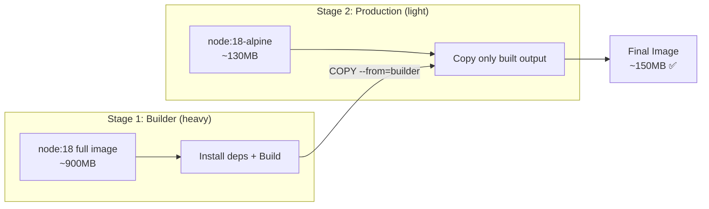
```dockerfile
# Stage 1: Build
FROM node:18 AS builder
WORKDIR /app
COPY package*.json ./
RUN npm ci
COPY . .
RUN npm run build

# Stage 2: Production (only the built output)
FROM node:18-alpine
WORKDIR /app
COPY --from=builder /app/dist ./dist
COPY --from=builder /app/node_modules ./node_modules
COPY package*.json ./
EXPOSE 3000
USER node
CMD ["node", "dist/index.js"]
```

### Python Example
```dockerfile
FROM python:3.11-slim

WORKDIR /app

COPY requirements.txt .
RUN pip install --no-cache-dir -r requirements.txt

COPY . .

EXPOSE 8000

CMD ["uvicorn", "main:app", "--host", "0.0.0.0", "--port", "8000"]
```

### CMD vs ENTRYPOINT
```dockerfile
# CMD — can be overridden at runtime
CMD ["python", "app.py"]
# docker run myapp python other.py   ← overrides CMD

# ENTRYPOINT — always runs, CMD becomes arguments
ENTRYPOINT ["python"]
CMD ["app.py"]
# docker run myapp other.py   ← runs: python other.py
```

### Layer Caching Best Practices
```dockerfile
# ❌ BAD: Any code change invalidates npm install cache
COPY . .
RUN npm install

# ✅ GOOD: Dependencies cached separately
COPY package*.json ./
RUN npm ci --only=production
COPY . .
```

### .dockerignore
Create `.dockerignore` to exclude files from build context:
```
node_modules
.git
.env
*.md
.DS_Store
dist
coverage
.vscode
```

### Security Best Practices
```dockerfile
# Use specific tags (not :latest)
FROM node:18.19-alpine

# Use non-root user
RUN addgroup -g 1001 -S appgroup && \
    adduser -S appuser -u 1001 -G appgroup
USER appuser

# Use minimal base images (alpine, slim, distroless)
FROM gcr.io/distroless/nodejs18-debian12

# Don't store secrets in images — use runtime env vars or secrets
```

---


## 🎼 Docker Compose

Docker Compose manages multi-container applications with a single YAML file.

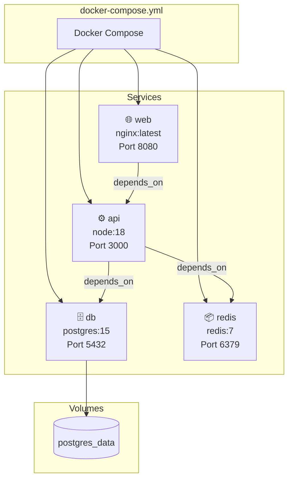

### Basic docker-compose.yml
```yaml
version: '3.8'

services:
  web:
    image: nginx:latest
    ports:
      - "8080:80"
    volumes:
      - ./html:/usr/share/nginx/html
    depends_on:
      - api

  api:
    build: ./api
    ports:
      - "3000:3000"
    environment:
      - DATABASE_URL=postgres://user:pass@db:5432/mydb
    depends_on:
      - db

  db:
    image: postgres:15
    environment:
      - POSTGRES_USER=user
      - POSTGRES_PASSWORD=pass
      - POSTGRES_DB=mydb
    volumes:
      - postgres_data:/var/lib/postgresql/data
    ports:
      - "5432:5432"

  redis:
    image: redis:7-alpine
    ports:
      - "6379:6379"

volumes:
  postgres_data:
```

### Commands
```bash
# Start all services
docker-compose up

# Start in background
docker-compose up -d

# Start specific service
docker-compose up -d web

# Build and start
docker-compose up --build

# Stop all services
docker-compose down

# Stop and remove volumes
docker-compose down -v

# View logs
docker-compose logs

# Follow logs for a service
docker-compose logs -f api

# Execute command in running service
docker-compose exec api npm test

# Run one-off command
docker-compose run --rm api npm run migrate

# Scale a service
docker-compose up --scale web=3

# List services
docker-compose ps

# Restart a service
docker-compose restart api

# Pull latest images
docker-compose pull

# Build images without starting
docker-compose build
```

### Environment Variables
```yaml
services:
  api:
    image: myapp:latest
    environment:
      - NODE_ENV=production
      - SECRET_KEY=${SECRET_KEY}   # from host or .env file
    env_file:
      - .env
      - .env.production
```

### Health Checks
```yaml
services:
  db:
    image: postgres:15
    healthcheck:
      test: ["CMD-SHELL", "pg_isready -U postgres"]
      interval: 10s
      timeout: 5s
      retries: 5

  api:
    build: .
    depends_on:
      db:
        condition: service_healthy
```

### Custom Networks in Compose
```yaml
services:
  web:
    networks:
      - frontend

  api:
    networks:
      - frontend
      - backend

  db:
    networks:
      - backend

networks:
  frontend:
  backend:
```

### Resource Limits in Compose
```yaml
services:
  api:
    image: myapp:latest
    deploy:
      resources:
        limits:
          cpus: '1.5'
          memory: 512M
        reservations:
          cpus: '0.5'
          memory: 256M
```

---


## 🌐 Docker Networking

Docker networking allows containers to communicate with each other and the outside world.

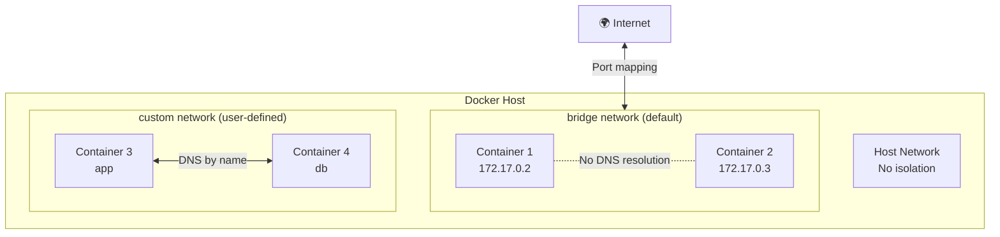

> ⚠️ **Tip:** Use custom networks over the default bridge — they provide automatic DNS resolution between containers by name.

### Network Drivers

| Driver | Use Case | Description |
|--------|----------|-------------|
| **bridge** | Default | Containers on same host communicate via internal network |
| **host** | Performance | Container uses host's network directly (no isolation) |
| **overlay** | Multi-host | Containers across multiple hosts (Docker Swarm) |
| **macvlan** | Legacy apps | Assigns MAC address, container appears as physical device |
| **none** | Maximum isolation | No networking |

### Manage Networks
```bash
# List networks
docker network ls

# Create network
docker network create mynetwork

# Create with specific driver
docker network create --driver bridge mynetwork

# Create with subnet
docker network create --subnet=172.20.0.0/16 mynetwork

# Inspect network
docker network inspect mynetwork

# Remove network
docker network rm mynetwork

# Remove all unused networks
docker network prune
```

### Connect Containers
```bash
# Run container on a specific network
docker run -d --name api --network mynetwork myapp:latest

# Connect running container to network
docker network connect mynetwork mycontainer

# Disconnect from network
docker network disconnect mynetwork mycontainer

# Containers on the same network can reach each other by name:
# From 'web' container: curl http://api:3000
```

### Network Examples
```bash
# Create isolated network for an app
docker network create app-network

# Run database on the network
docker run -d --name db --network app-network \
  -e POSTGRES_PASSWORD=secret postgres:15

# Run app on same network (can access db by name)
docker run -d --name api --network app-network \
  -e DATABASE_URL=postgres://postgres:secret@db:5432/postgres \
  myapp:latest

# App can now reach database at hostname "db"
```

---


## 💾 Docker Volumes

Volumes persist data beyond the container lifecycle. Without them, data is lost when the container is removed.

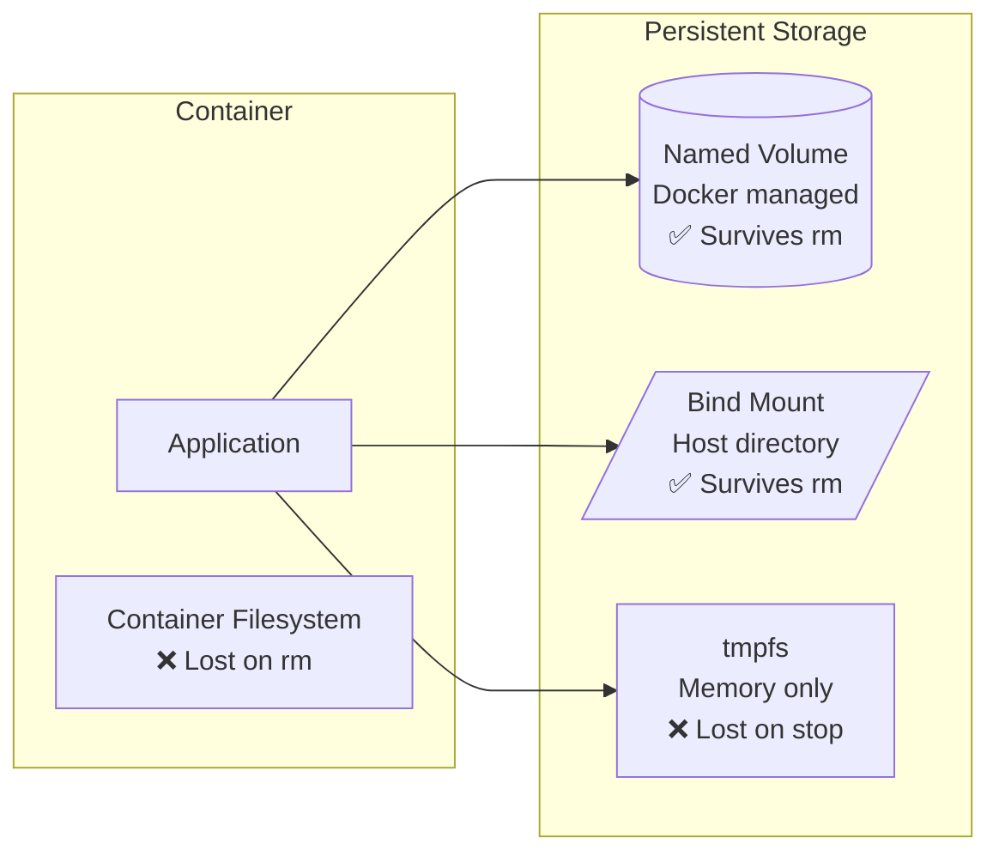

### Volume Types

| Type | Syntax | Use Case |
|------|--------|----------|
| **Named Volume** | `-v mydata:/app/data` | Databases, production data |
| **Bind Mount** | `-v /host/path:/container/path` | Development, config files |
| **Anonymous Volume** | `-v /container/path` | Temporary data |

### Manage Volumes
```bash
# List volumes
docker volume ls

# Create volume
docker volume create mydata

# Inspect volume
docker volume inspect mydata

# Remove volume
docker volume rm mydata

# Remove all unused volumes
docker volume prune
```

### Using Volumes
```bash
# Named volume (Docker manages the location)
docker run -v mydata:/app/data nginx

# Bind mount (specific host directory)
docker run -v $(pwd)/src:/app/src nginx

# Read-only mount
docker run -v $(pwd)/config:/etc/nginx/conf.d:ro nginx

# Multiple volumes
docker run -v data:/data -v logs:/var/log nginx

# Windows bind mount
docker run -v C:\Users\me\project:/app nginx
```

### Backup & Restore Volumes
```bash
# Backup a volume to tar file
docker run --rm \
  -v mydata:/data \
  -v $(pwd):/backup \
  ubuntu tar czf /backup/mydata-backup.tar.gz -C /data .

# Restore volume from backup
docker run --rm \
  -v mydata:/data \
  -v $(pwd):/backup \
  ubuntu tar xzf /backup/mydata-backup.tar.gz -C /data
```

### Share Data Between Containers
```bash
# Create shared volume
docker volume create shared-data

# Container 1 writes data
docker run -d --name writer -v shared-data:/data alpine sh -c "while true; do date >> /data/log.txt; sleep 5; done"

# Container 2 reads the same data
docker run --rm -v shared-data:/data alpine cat /data/log.txt
```

---


## 🔍 Logs & Debugging

### View Logs
```bash
# View container logs
docker logs mycontainer

# Follow logs (live stream)
docker logs -f mycontainer

# Show last N lines
docker logs --tail 100 mycontainer

# Show logs with timestamps
docker logs -t mycontainer

# Show logs since a time
docker logs --since "2025-01-01T00:00:00" mycontainer

# Show logs in last 30 minutes
docker logs --since 30m mycontainer
```

### Execute Commands in Running Container
```bash
# Run a command
docker exec mycontainer ls /app

# Get interactive shell
docker exec -it mycontainer /bin/bash

# Get shell (Alpine-based images)
docker exec -it mycontainer /bin/sh

# Run as root
docker exec -u root mycontainer whoami

# Set working directory
docker exec -w /app mycontainer pwd
```

### Inspect & Monitor
```bash
# Full container details
docker inspect mycontainer

# Container IP address
docker inspect -f '{{.NetworkSettings.IPAddress}}' mycontainer

# Container status
docker inspect -f '{{.State.Status}}' mycontainer

# Container exit code
docker inspect -f '{{.State.ExitCode}}' mycontainer

# Mounted volumes
docker inspect -f '{{.Mounts}}' mycontainer

# Live resource usage
docker stats

# Stats for specific container (no streaming)
docker stats --no-stream mycontainer

# Custom stats format
docker stats --format "table {{.Container}}\t{{.CPUPerc}}\t{{.MemUsage}}"

# Show running processes inside container
docker top mycontainer

# Show port mappings
docker port mycontainer

# Show filesystem changes
docker diff mycontainer

# Docker system events
docker events
docker events --filter 'container=mycontainer'
```

### System Information
```bash
# Disk usage by Docker
docker system df

# Detailed disk usage
docker system df -v

# Docker system info
docker info
```

---

## 📊 Resource Management

### Memory
```bash
# Limit memory to 512MB
docker run -m 512m nginx

# Memory + swap limit
docker run -m 512m --memory-swap 1g nginx

# Disable swap
docker run -m 512m --memory-swap 512m nginx
```

### CPU
```bash
# Limit to 1.5 CPU cores
docker run --cpus="1.5" nginx

# Relative CPU weight (default: 1024)
docker run --cpu-shares=512 nginx

# Pin to specific CPUs
docker run --cpuset-cpus="0,1" nginx
```

### Cleanup Commands
```bash
# Remove stopped containers
docker container prune

# Remove unused images
docker image prune

# Remove unused volumes
docker volume prune

# Remove unused networks
docker network prune

# Remove ALL unused data (containers, images, networks, volumes)
docker system prune

# Including unused images (not just dangling)
docker system prune -a

# Also remove volumes
docker system prune -a --volumes
```

---


## 🏪 Docker Hub & Registries

### Docker Hub
```bash
# Login
docker login

# Login with username
docker login -u yourusername

# Logout
docker logout

# Search for images
docker search nginx

# Push image to Docker Hub
docker tag myapp:latest yourusername/myapp:latest
docker push yourusername/myapp:latest

# Pull from Docker Hub
docker pull yourusername/myapp:latest
```

### Private Registries (AWS ECR, Azure ACR, GCR)
```bash
# AWS ECR Login
aws ecr get-login-password --region us-east-1 | docker login --username AWS --password-stdin 123456789.dkr.ecr.us-east-1.amazonaws.com

# Tag for ECR
docker tag myapp:latest 123456789.dkr.ecr.us-east-1.amazonaws.com/myapp:latest

# Push to ECR
docker push 123456789.dkr.ecr.us-east-1.amazonaws.com/myapp:latest

# Azure ACR Login
az acr login --name myregistry

# Google GCR Login
gcloud auth configure-docker
```

### Tagging Best Practices
```bash
# Semantic versioning
docker tag myapp:latest myapp:1.0.0

# Git commit SHA (for traceability)
docker tag myapp:latest myapp:abc1234

# Environment-based
docker tag myapp:latest myapp:production
```

---

## 🔄 Real-World Workflows

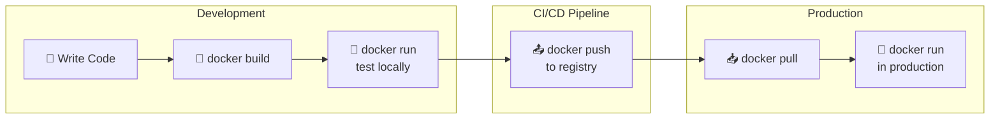

### Development Workflow
```bash
# 1. Build dev image
docker build -t myapp:dev .

# 2. Run with live code mount
docker run -d -p 3000:3000 \
  -v $(pwd):/app \
  -v /app/node_modules \
  --name myapp-dev \
  myapp:dev

# 3. Watch logs
docker logs -f myapp-dev

# 4. Run tests inside container
docker exec myapp-dev npm test

# 5. Clean up
docker stop myapp-dev && docker rm myapp-dev
```

### Production Deployment
```bash
# 1. Build production image
docker build -f Dockerfile.prod -t myapp:1.0.0 .

# 2. Test locally
docker run -d -p 8080:3000 --name test myapp:1.0.0
curl http://localhost:8080/health
docker stop test && docker rm test

# 3. Tag and push
docker tag myapp:1.0.0 registry.example.com/myapp:1.0.0
docker push registry.example.com/myapp:1.0.0

# 4. Deploy on server
docker pull registry.example.com/myapp:1.0.0
docker stop myapp-prod || true
docker rm myapp-prod || true
docker run -d -p 80:3000 \
  --name myapp-prod \
  --restart unless-stopped \
  registry.example.com/myapp:1.0.0
```

### Full-Stack Docker Compose (Dev)
```yaml
# docker-compose.dev.yml
version: '3.8'

services:
  frontend:
    build: ./frontend
    ports:
      - "3000:3000"
    volumes:
      - ./frontend/src:/app/src
    environment:
      - REACT_APP_API_URL=http://localhost:5000

  backend:
    build: ./backend
    ports:
      - "5000:5000"
    volumes:
      - ./backend:/app
      - /app/node_modules
    environment:
      - DATABASE_URL=postgres://user:pass@db:5432/myapp
      - REDIS_URL=redis://redis:6379
    depends_on:
      - db
      - redis

  db:
    image: postgres:15
    environment:
      - POSTGRES_USER=user
      - POSTGRES_PASSWORD=pass
      - POSTGRES_DB=myapp
    volumes:
      - pgdata:/var/lib/postgresql/data
    ports:
      - "5432:5432"

  redis:
    image: redis:7-alpine
    ports:
      - "6379:6379"

volumes:
  pgdata:
```

---

## 🛠️ Troubleshooting

### Container Won't Start
```bash
# Check status and exit code
docker ps -a
docker inspect -f '{{.State.ExitCode}}' mycontainer

# View logs for errors
docker logs mycontainer

# Try running interactively to see errors
docker run -it myimage /bin/bash

# Check events
docker events --since 10m
```

### Port Already in Use
```bash
# Find what's using the port
docker ps --filter "publish=8080"
# Or on host:
netstat -ano | findstr :8080   # Windows
lsof -i :8080                  # Linux/Mac

# Use a different port
docker run -p 8081:80 nginx
```

### Out of Disk Space
```bash
# Check Docker disk usage
docker system df

# Clean up everything unused
docker system prune -a --volumes
```

### Container Keeps Restarting
```bash
# Check restart policy
docker inspect -f '{{.HostConfig.RestartPolicy.Name}}' mycontainer

# View logs for crash reason
docker logs --tail 50 mycontainer

# Check exit code
docker inspect -f '{{.State.ExitCode}}' mycontainer

# Run without restart to see error
docker run --restart=no myimage
```

### Network Issues
```bash
# Test connectivity from inside container
docker exec mycontainer ping google.com

# Check DNS resolution
docker exec mycontainer nslookup api

# Inspect network
docker network inspect bridge

# Check container's networks
docker inspect -f '{{.NetworkSettings.Networks}}' mycontainer
```

### Permission Denied
```bash
# Check file ownership inside container
docker exec mycontainer ls -la /app

# Fix permissions
docker exec -u root mycontainer chown -R 1000:1000 /app

# Or in Dockerfile:
# RUN chown -R node:node /app
# USER node
```

### Image Build Fails
```bash
# Build with verbose output
docker build --progress=plain -t myapp .

# Build without cache
docker build --no-cache -t myapp .

# Check Dockerfile syntax
docker build --check .
```

---

## 📋 Quick Reference

### Most Used Commands

| Task | Command |
|------|---------|
| Run container | `docker run -d -p 8080:80 --name web nginx` |
| List running | `docker ps` |
| List all | `docker ps -a` |
| Stop | `docker stop web` |
| Remove | `docker rm web` |
| Logs | `docker logs -f web` |
| Shell access | `docker exec -it web /bin/bash` |
| Build image | `docker build -t myapp .` |
| List images | `docker images` |
| Remove image | `docker rmi myapp` |
| Pull image | `docker pull nginx:latest` |
| Push image | `docker push user/myapp:latest` |
| Compose up | `docker-compose up -d` |
| Compose down | `docker-compose down` |
| Clean up | `docker system prune -a` |

### Common Flags

| Flag | Purpose | Example |
|------|---------|---------|
| `-d` | Detached (background) | `docker run -d nginx` |
| `-it` | Interactive terminal | `docker run -it ubuntu bash` |
| `-p` | Port mapping | `-p 8080:80` |
| `-v` | Volume mount | `-v data:/app/data` |
| `-e` | Environment variable | `-e KEY=value` |
| `--name` | Container name | `--name myapp` |
| `--rm` | Auto-remove on stop | `docker run --rm nginx` |
| `-m` | Memory limit | `-m 512m` |
| `--cpus` | CPU limit | `--cpus="1.5"` |
| `--network` | Network | `--network mynet` |
| `--restart` | Restart policy | `--restart unless-stopped` |
| `-f` | Follow/File | `logs -f` or `build -f` |

### Exit Codes

| Code | Meaning |
|------|---------|
| `0` | Success |
| `1` | Application error |
| `125` | Docker daemon error |
| `126` | Command cannot be invoked |
| `127` | Command not found |
| `137` | Killed (OOM or `docker kill`) |
| `143` | Graceful termination (SIGTERM) |

---

## 📚 Additional Resources

- [Official Docker Documentation](https://docs.docker.com/)
- [Docker Hub](https://hub.docker.com/)
- [Dockerfile Reference](https://docs.docker.com/engine/reference/builder/)
- [Docker Compose Reference](https://docs.docker.com/compose/compose-file/)
- [Docker Security Best Practices](https://docs.docker.com/engine/security/)

---

## 🤝 Contributing

Feel free to open issues or submit pull requests to improve this guide!

## 📄 License

This project is licensed under the MIT License - see the [LICENSE](LICENSE) file for details.

---

⭐ **If this guide helped you, give it a star!**
