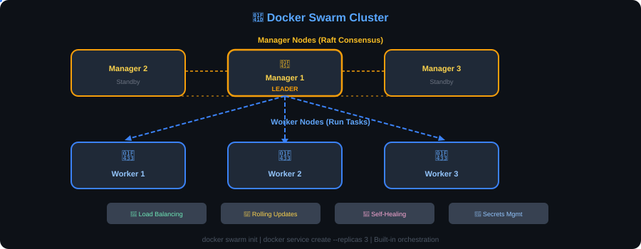

> [📖 Main Guide](README.md) | [📋 Cheatsheet](cheatsheet.md) | [🎯 Interview Q&A](interview-questions.md) | [🔒 Security](docker-security.md) | [🔧 Troubleshooting](docker-troubleshooting-flowchart.md) | [📊 Monitoring](docker-monitoring.md) | [☸️ Docker vs K8s](docker-vs-kubernetes.md)

# 🐝 Docker Swarm Guide

> Docker's built-in container orchestration for clustering and scaling.

---

## What is Docker Swarm?

Docker Swarm turns a group of Docker hosts into a single virtual Docker host. It provides native clustering, load balancing, and service discovery.

<p align="center">
  
</p>

### Swarm vs Kubernetes

| Feature | Docker Swarm | Kubernetes |
|---------|-------------|------------|
| Setup | Simple (built into Docker) | Complex |
| Learning Curve | Easy | Steep |
| Scaling | Basic | Advanced (HPA, VPA) |
| Load Balancing | Built-in | Needs Ingress |
| Rolling Updates | Yes | Yes |
| Self-Healing | Yes | Yes |
| Market Share | Small | Dominant |
| Best For | Small-medium deployments | Large-scale production |

---

## Initialize Swarm

```bash
# Initialize swarm (current node becomes manager)
docker swarm init

# Initialize with specific advertise address
docker swarm init --advertise-addr 192.168.1.100

# Get worker join token
docker swarm join-token worker

# Get manager join token
docker swarm join-token manager
```

## Join Nodes to Swarm

```bash
# Join as worker (run on worker nodes)
docker swarm join --token SWMTKN-1-xxxxx 192.168.1.100:2377

# Join as manager (run on other manager nodes)
docker swarm join --token SWMTKN-1-xxxxx-manager 192.168.1.100:2377
```

## Node Management

```bash
# List nodes
docker node ls

# Inspect node
docker node inspect node-name

# Promote worker to manager
docker node promote node-name

# Demote manager to worker
docker node demote node-name

# Remove node from swarm
docker node rm node-name

# Drain node (stop scheduling new tasks)
docker node update --availability drain node-name

# Reactivate node
docker node update --availability active node-name

# Leave swarm (run on the node leaving)
docker swarm leave

# Force leave (for managers)
docker swarm leave --force
```

---

## Services

Services are the primary way to deploy applications in Swarm.

### Create Services

```bash
# Create a simple service
docker service create --name web nginx:latest

# Create with replicas
docker service create --name web --replicas 3 nginx:latest

# Create with port publishing
docker service create --name web -p 8080:80 --replicas 3 nginx:latest

# Create with environment variables
docker service create --name api \
  -e NODE_ENV=production \
  -e DB_HOST=db \
  --replicas 2 \
  myapp:latest

# Create with volume
docker service create --name db \
  --mount type=volume,source=dbdata,target=/var/lib/postgresql/data \
  postgres:15

# Create with resource limits
docker service create --name api \
  --limit-cpu 1.0 \
  --limit-memory 512m \
  --reserve-cpu 0.5 \
  --reserve-memory 256m \
  --replicas 3 \
  myapp:latest

# Create with placement constraints
docker service create --name db \
  --constraint 'node.role == manager' \
  postgres:15

# Create with update config
docker service create --name web \
  --replicas 5 \
  --update-parallelism 2 \
  --update-delay 10s \
  nginx:latest
```

### Manage Services

```bash
# List services
docker service ls

# List service tasks (containers)
docker service ps web

# Inspect service
docker service inspect web

# View service logs
docker service logs web
docker service logs -f web

# Scale service
docker service scale web=5

# Scale multiple services
docker service scale web=5 api=3

# Remove service
docker service rm web
```

### Update Services (Rolling Updates)

```bash
# Update image
docker service update --image nginx:1.25 web

# Update with rollback config
docker service update \
  --image myapp:v2 \
  --update-parallelism 2 \
  --update-delay 10s \
  --update-failure-action rollback \
  web

# Add/update environment variable
docker service update --env-add NEW_VAR=value web

# Remove environment variable
docker service update --env-rm OLD_VAR web

# Update port
docker service update --publish-add 8081:81 web

# Update replicas
docker service update --replicas 5 web

# Rollback to previous version
docker service rollback web
```

---

## Stack (Compose in Swarm)

Deploy multi-service applications using docker-compose files.

### Deploy a Stack

```yaml
# docker-stack.yml
version: '3.8'

services:
  web:
    image: nginx:latest
    ports:
      - "80:80"
    deploy:
      replicas: 3
      update_config:
        parallelism: 1
        delay: 10s
      restart_policy:
        condition: on-failure

  api:
    image: myapp:latest
    deploy:
      replicas: 2
      resources:
        limits:
          cpus: '1.0'
          memory: 512M

  db:
    image: postgres:15
    volumes:
      - dbdata:/var/lib/postgresql/data
    deploy:
      replicas: 1
      placement:
        constraints:
          - node.role == manager

volumes:
  dbdata:
```

### Stack Commands

```bash
# Deploy stack
docker stack deploy -c docker-stack.yml myapp

# List stacks
docker stack ls

# List services in stack
docker stack services myapp

# List tasks in stack
docker stack ps myapp

# Remove stack
docker stack rm myapp
```

---

## Secrets Management

```bash
# Create a secret
echo "my_password" | docker secret create db_password -

# Create from file
docker secret create ssl_cert ./server.crt

# List secrets
docker secret ls

# Inspect secret (metadata only, not value)
docker secret inspect db_password

# Remove secret
docker secret rm db_password

# Use secret in service
docker service create --name db \
  --secret db_password \
  -e POSTGRES_PASSWORD_FILE=/run/secrets/db_password \
  postgres:15
```

---

## Networking in Swarm

```bash
# Create overlay network (multi-host)
docker network create --driver overlay my-overlay

# Create encrypted overlay
docker network create --driver overlay --opt encrypted secure-net

# Attach service to network
docker service create --name web --network my-overlay nginx

# Services on the same overlay network can communicate by service name
```

---

## Health Checks & Self-Healing

```bash
# Service with health check
docker service create --name web \
  --health-cmd "curl -f http://localhost/ || exit 1" \
  --health-interval 30s \
  --health-timeout 3s \
  --health-retries 3 \
  nginx:latest

# Swarm automatically replaces unhealthy containers
```

---

## Quick Reference

| Task | Command |
|------|---------|
| Init swarm | `docker swarm init` |
| Join worker | `docker swarm join --token TOKEN HOST:2377` |
| List nodes | `docker node ls` |
| Create service | `docker service create --name web -p 80:80 --replicas 3 nginx` |
| Scale | `docker service scale web=5` |
| Update image | `docker service update --image nginx:1.25 web` |
| Rollback | `docker service rollback web` |
| Deploy stack | `docker stack deploy -c file.yml stackname` |
| Remove stack | `docker stack rm stackname` |
| Service logs | `docker service logs -f web` |
| Drain node | `docker node update --availability drain node` |
| Create secret | `echo "pass" \| docker secret create name -` |
| Leave swarm | `docker swarm leave --force` |

---

*Created by [Krishna Yada](https://github.com/yadakrishna245) ⭐*
