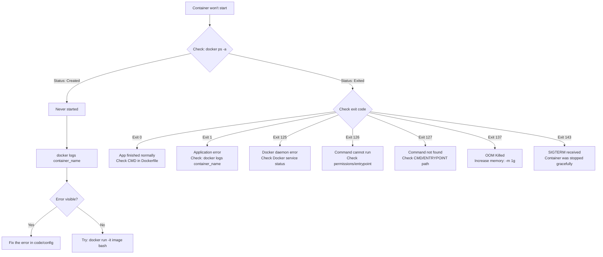
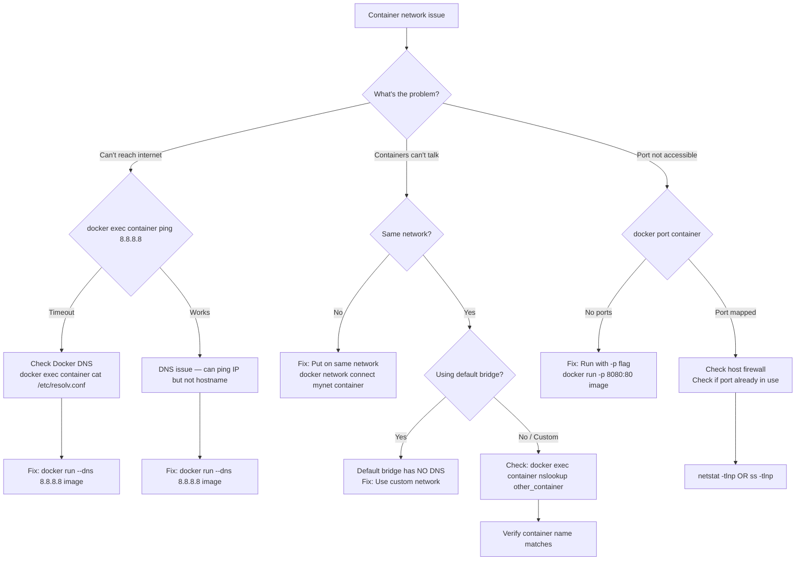
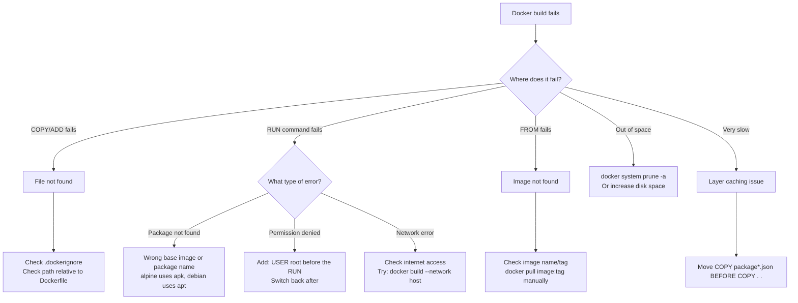
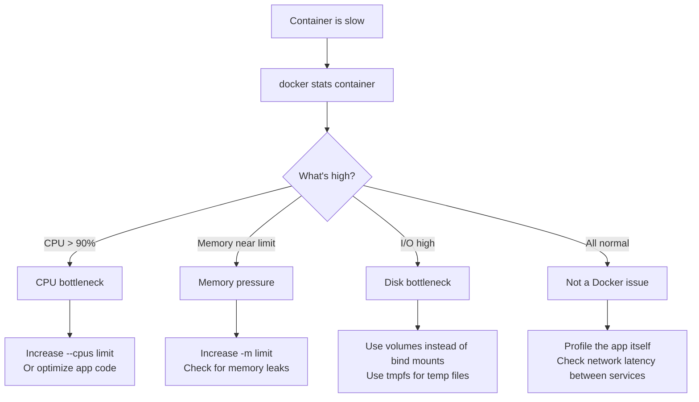
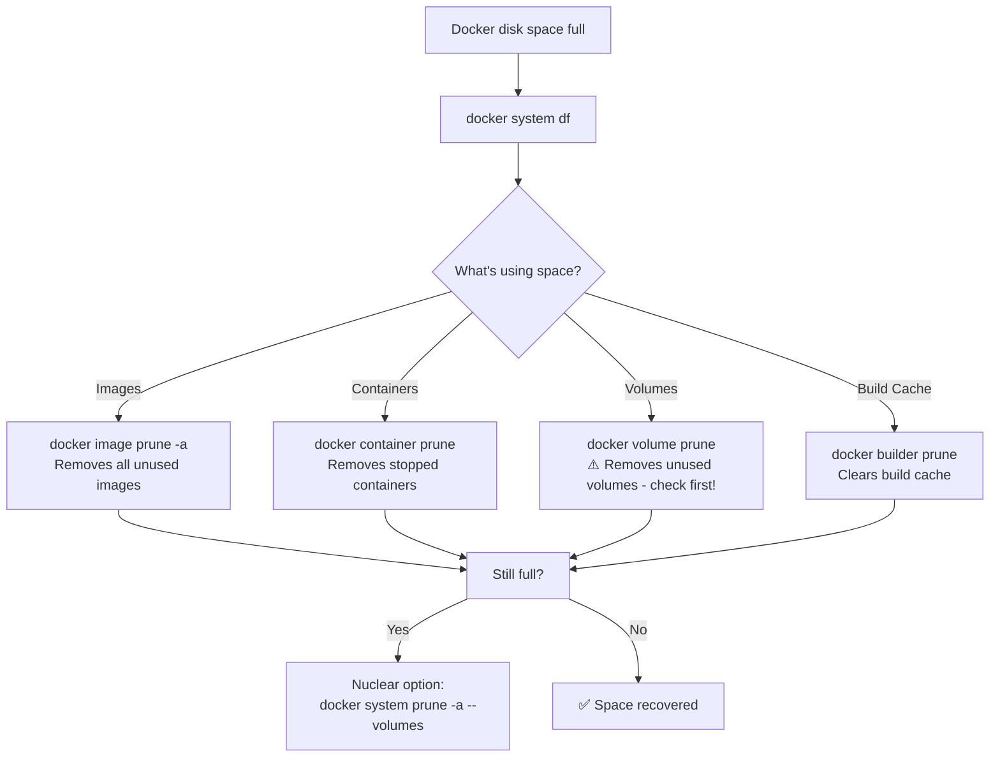

# 🔧 Docker Troubleshooting Flowcharts

> Visual decision trees to quickly diagnose and fix common Docker issues.

---

## 🚫 Container Won't Start



---

## 🌐 Network Issues



---

## 💾 Volume / Data Issues

```mermaid
flowchart TD
    A[Volume/Data problem] --> B{What's the issue?}
    
    B -->|Data lost after restart| C{Using volumes?}
    C -->|No| D[Fix: Add volume<br/>docker run -v mydata:/app/data image]
    C -->|Yes| E[Check volume mount path<br/>docker inspect container]
    
    B -->|Permission denied| F{Who owns the files?}
    F --> F1[docker exec container ls -la /path]
    F1 -->|Root owns, app is non-root| F2[Fix in Dockerfile:<br/>RUN chown -R appuser:appuser /path]
    F1 -->|UID mismatch| F3[Fix: Match host UID<br/>docker run -u $(id -u):$(id -g) image]
    
    B -->|Volume not showing data| G[Check mount path is correct]
    G --> G1[docker inspect -f '{{.Mounts}}' container]
    G1 --> G2{Path correct?}
    G2 -->|No| G3[Fix the -v path]
    G2 -->|Yes| G4[Check if container writes to that path]
```

---

## 🖼️ Image Build Fails



---

## 🔄 Container Keeps Restarting

```mermaid
flowchart TD
    A[Container restart loop] --> B[docker logs --tail 50 container]
    B --> C{Error visible?}
    
    C -->|Yes - App crash| D[Fix app code/config]
    C -->|Yes - Port in use| E[Change port or stop conflicting container]
    C -->|Yes - File not found| F[Check volumes and WORKDIR]
    C -->|Yes - OOM| G[Increase memory limit: -m 1g]
    C -->|No error visible| H{Check exit code}
    
    H --> I[docker inspect -f '{{.State.ExitCode}}' container]
    I -->|137| J[Out of memory → increase -m]
    I -->|1| K[App error → run interactively to debug]
    I -->|0| L[App exits normally → check CMD keeps running]
    
    L --> L1[CMD must be a long-running process<br/>Not a script that exits]
```

---

## 🐌 Container Running Slow



---

## 🧹 Disk Space Full



---

## 🔍 Quick Diagnostic Commands

```bash
# System overview
docker system df              # Disk usage
docker system info            # System info
docker system events          # Real-time events

# Container diagnosis
docker inspect container      # Full details
docker logs container         # Logs
docker stats container        # Resource usage
docker top container          # Running processes
docker diff container         # File changes
docker port container         # Port mappings

# Network diagnosis
docker network ls             # List networks
docker network inspect net    # Network details
docker exec container ping host  # Test connectivity
docker exec container nslookup service  # Test DNS

# Image diagnosis
docker history image          # Layer history
docker inspect image          # Image details
```

---

*Created by [Krishna Yada](https://github.com/yadakrishna245) ⭐*
