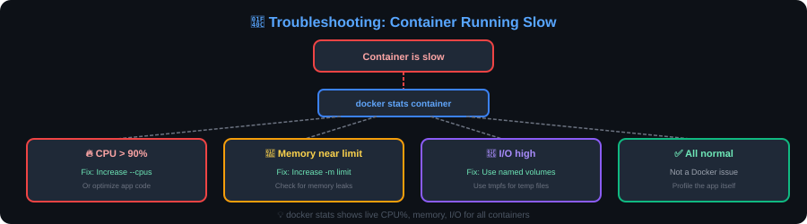

> [📖 Main Guide](README.md) | [📋 Cheatsheet](cheatsheet.md) | [🎯 Interview Q&A](interview-questions.md) | [🔒 Security](docker-security.md) | [🐝 Swarm](docker-swarm.md) | [📊 Monitoring](docker-monitoring.md) | [☸️ Docker vs K8s](docker-vs-kubernetes.md)

# 🔧 Docker Troubleshooting Flowcharts

> Visual decision trees to quickly diagnose and fix common Docker issues.

---

## 🚫 Container Won't Start

<p align="center">
  
</p>

---

## 🌐 Network Issues

<p align="center">
  
</p>

---

## 💾 Volume / Data Issues

<p align="center">
  
</p>

---

## 🖼️ Image Build Fails

<p align="center">
  
</p>

---

## 🔄 Container Keeps Restarting

<p align="center">
  
</p>

---

## 🐌 Container Running Slow

<p align="center">
  
</p>

---

## 🧹 Disk Space Full

<p align="center">
  
</p>

---

## 🔍 Quick Diagnostic Commands

```bash
# System overview
docker system df              # Disk usage
docker system info            # System info
docker system events          # Real-time events

# Container diagnosis
docker inspect container      # Full details
docker logs container         # Logs
docker stats container        # Resource usage
docker top container          # Running processes
docker diff container         # File changes
docker port container         # Port mappings

# Network diagnosis
docker network ls             # List networks
docker network inspect net    # Network details
docker exec container ping host  # Test connectivity
docker exec container nslookup service  # Test DNS

# Image diagnosis
docker history image          # Layer history
docker inspect image          # Image details
```

---

*Created by [Krishna Yada](https://github.com/yadakrishna245) ⭐*
